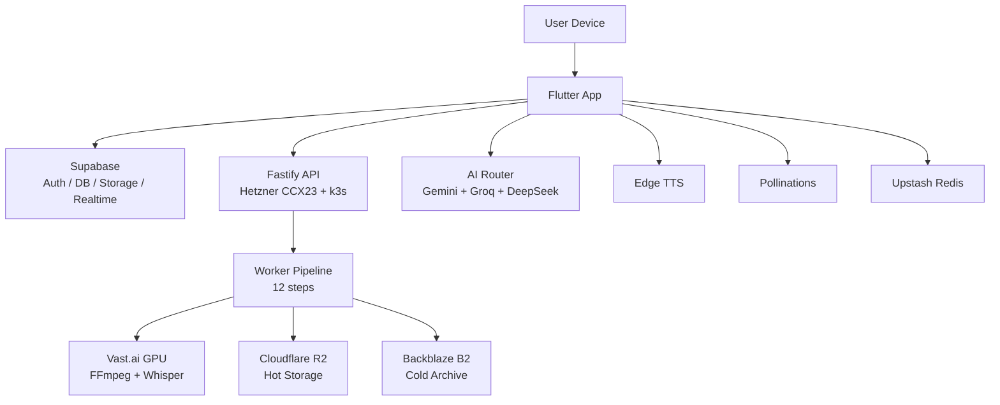
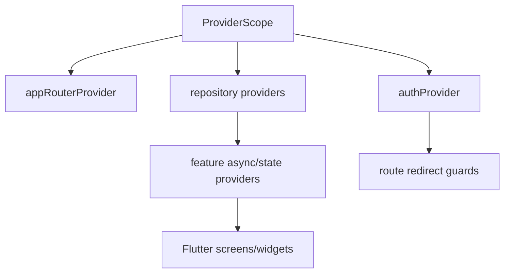
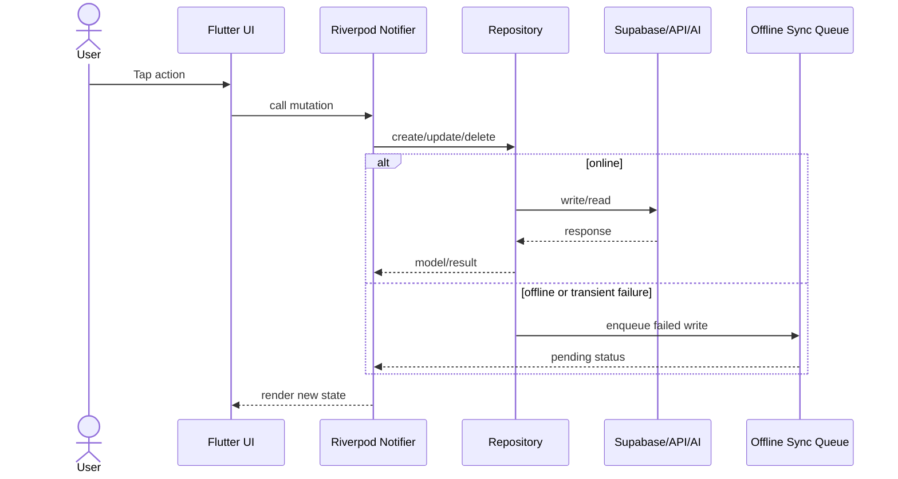
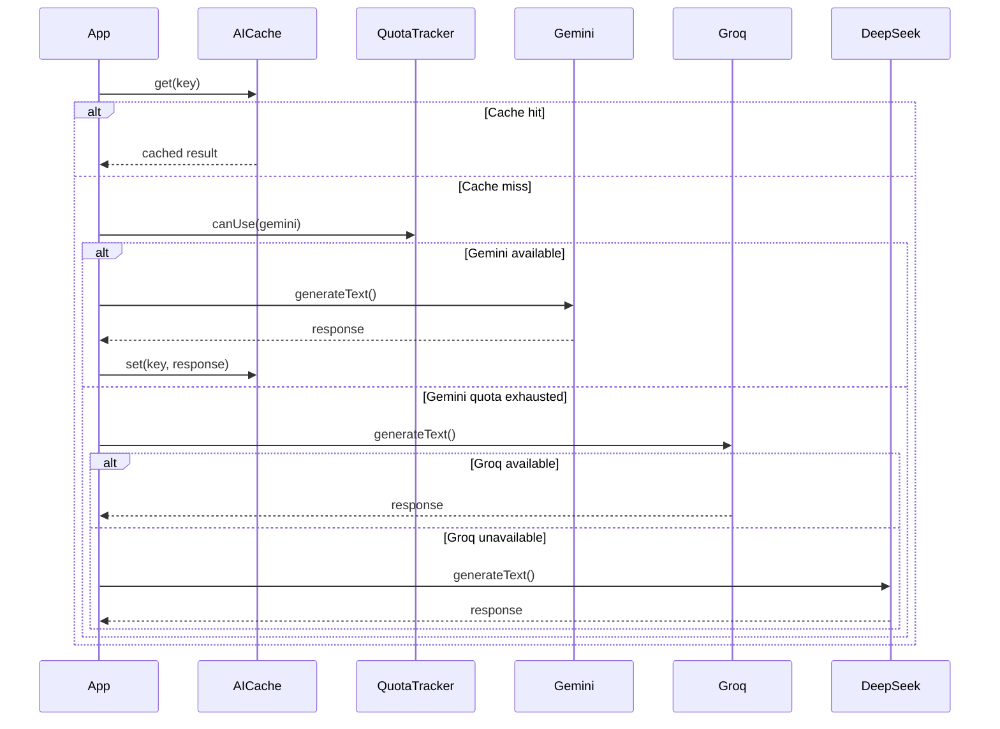

# AutoShort Architecture

## Overview

AutoShort is an Android-first Flutter application with a free-first AI stack, Supabase-backed user data, and a server/worker pipeline for heavier video processing. The root `lib/` folder is the canonical mobile app. Backend and worker folders are present in the repository but are documented as separate execution surfaces.

## High-Level Architecture

## Module Boundaries

| Module | Responsibility |
| --- | --- |
| `lib/core/` | Environment loading, logger, Dio network client, AI router, theme, constants, utilities. |
| `lib/features/` | Feature screens and providers: auth, splash, onboarding, home, library, editor, subtitle, thumbnail, templates, hook generator, brand kit, calendar, analytics, pricing, profile. |
| `lib/shared/` | Reusable widgets, freezed models, repositories, mock/API/Supabase implementations, local storage, sync services. |
| `lib/routing/` | go_router setup, route constants, shell navigation, auth guards. |

## State Management

AutoShort uses Riverpod 3.x patterns. Some early modules still use StateNotifier while newer modules can move toward generated `NotifierProvider` APIs.

Use provider types this way:

| Provider | Use when |
| --- | --- |
| `Provider` | Stateless dependency injection: repositories, services, config. |
| `StateProvider` | Small local state: selected tab, search query, filters. |
| `NotifierProvider` | Business state with mutations and validation. |
| `StreamProvider` | Realtime data such as projects, jobs, or notifications. |
| `FutureProvider` | One-shot async reads and computed dashboard data. |

## Data Flow

Offline-first rule: write intent is recorded locally, failed writes are queued, and background replay retries when connectivity returns.

## AI Provider Routing

## Database Schema

The active schema is documented in [docs/DATABASE_SCHEMA.md](docs/DATABASE_SCHEMA.md). Source migrations live under `supabase/migrations/*.sql`.

Core tables: profiles, projects, scripts, subtitles, thumbnails, templates, subscriptions, referrals, brand_kits, analytics_events, notifications.

## Storage Layout

| Bucket | Visibility | Purpose |
| --- | --- | --- |
| `avatars` | Public | User avatar images. |
| `uploads` | Private | Original source uploads, user-scoped. |
| `shortflow-videos` | Private | Processed videos and generated shorts. |
| `thumbnails` | Private | Thumbnail variants and exports. |
| `brand_assets` | Private | Logos, watermarks, intro/outro videos. |

## Tier Gating Summary

| Capability | Free | Standard | Premium | Lifetime |
| --- | --- | --- | --- | --- |
| Hook generations/day | 3 | 10 | Unlimited | Unlimited |
| Scheduled posts/month | 5 | 30 | Unlimited | Unlimited |
| Watermark removable | No | Yes | Yes | Yes |
| 4K export | No | No | Yes | Yes |
| Multi-account scheduling | No | No | Yes | Yes |
| Intro/outro brand video | No | No | Yes | Yes |

See [docs/TIER_FEATURE_MATRIX.md](docs/TIER_FEATURE_MATRIX.md) for the full table.

## Error Handling

- Domain operations return `Result<T, E>` where practical.
- Repositories map Dio/Supabase failures into typed app exceptions.
- UI renders snackbars or error states through shared components.
- Sentry breadcrumbs and Crashlytics are planned for Phase 1.5.

## Performance Targets

| Target | Goal |
| --- | --- |
| Cold start | Under 2 seconds on mid-range Android. |
| Warm start | Under 500 ms. |
| Scrolling | 60 FPS for library/template lists. |
| APK size | Under 40 MB split per ABI when release dependencies allow. |
