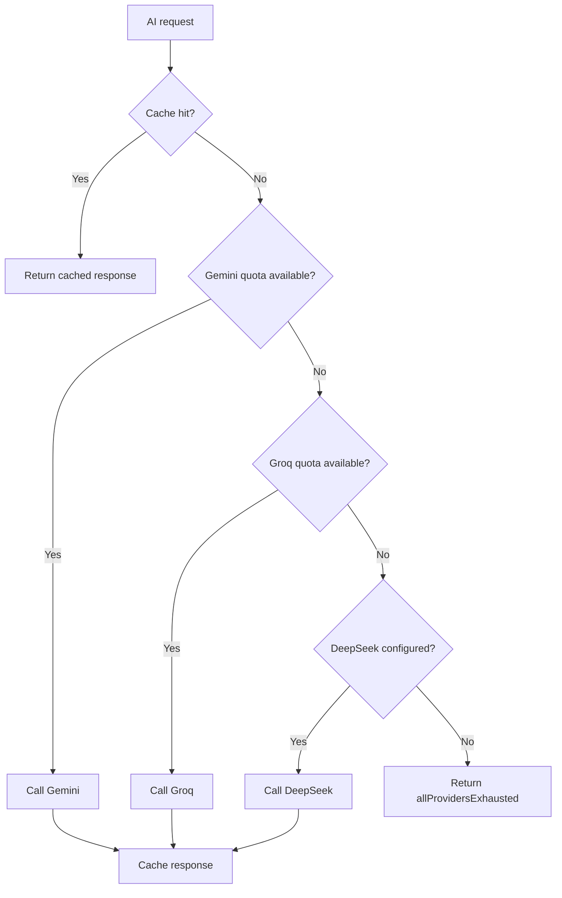

# AI Provider Strategy

## Free-First Philosophy

AutoShort uses free or generous-tier providers first so Phase 0 can validate product demand before paid infrastructure scales. The app should degrade gracefully: cache first, route to the cheapest available provider, and show actionable limits when all providers are exhausted.

## Provider Roles

| Provider | Role | Phase 0 use |
| --- | --- | --- |
| Gemini 2.0 Flash | Primary text generation | Hooks, metadata, captions, scripts. |
| Groq | Secondary LLM and Whisper STT | Text fallback and speech-to-text. |
| DeepSeek | Overflow text generation | Used after Gemini/Groq limits. |
| Edge TTS | Speech synthesis | Voiceover drafts and previews. |
| Pollinations | Image generation | Thumbnail mock/AI image options. |
| Upstash Redis | Result cache | Reduces repeat calls and cost. |

## Routing Logic

## Quota Policy

Quota reset uses Asia/Bangkok day boundaries. The tracker stores lightweight daily usage counters and treats provider quota errors as a signal to skip that provider until reset.

## Cost Projection

| Phase | Expected users | Strategy |
| --- | --- | --- |
| Phase 0 | Internal and trusted beta | Free tiers, aggressive caching. |
| Phase 1.5 | First paid users | Add paid quota for text generation and monitoring. |
| Phase 2 | Public launch | Blend paid LLM, GPU worker capacity, and strict per-tier limits. |

## Upgrade Triggers

Upgrade from free-tier routing when:

- Cache hit rate is below 40 percent and users hit limits daily.
- Paid users experience provider exhaustion.
- Median AI response time exceeds target for Premium users.
- Thumbnail/script quality requires stronger models.

## Failure Behavior

- Return typed `AIProviderError` values, not raw provider exceptions.
- Show user-facing retry/cooldown messages.
- Log provider, quota state, latency, and cache status without logging prompts that may contain personal data.
