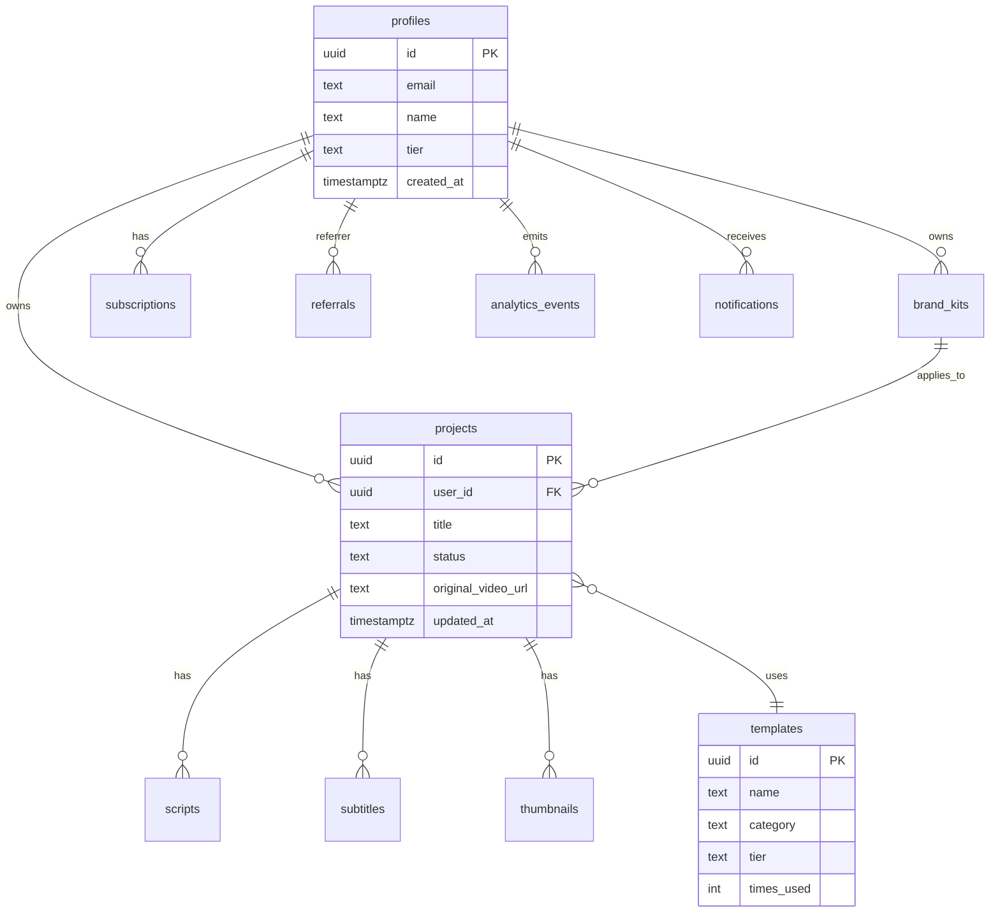

# Database Schema

Source of truth: `supabase/migrations/*.sql`. This document describes the intended mobile-facing schema and RLS behavior.

## ERD

## Tables

| Table | Purpose | Key indexes |
| --- | --- | --- |
| `profiles` | User profile and tier metadata. | `id`, `email`. |
| `projects` | Video project records. | `user_id`, `status`, `updated_at`. |
| `scripts` | AI-generated scripts and hook options. | `project_id`. |
| `subtitles` | Subtitle segments and style JSON. | `project_id`, `language`. |
| `thumbnails` | Thumbnail variants and CTR prediction. | `project_id`, `selected_variant`. |
| `templates` | Public and premium template definitions. | `category`, `tier`, `times_used`. |
| `subscriptions` | Billing and entitlement status. | `user_id`, `status`. |
| `referrals` | Referrer/referee reward state. | `referrer_user_id`, `referee_user_id`. |
| `brand_kits` | User brand assets and style tokens. | `user_id`. |
| `analytics_events` | Product events and audit-like activity. | `user_id`, `event_name`, `timestamp`. |
| `notifications` | In-app notification rows. | `user_id`, `is_read`, `created_at`. |

## RLS Policy Detail

- User-scoped tables require `user_id = auth.uid()` or equivalent owner column.
- `profiles.id = auth.uid()` for profile read/write.
- `templates` allows public reads and custom-template owner reads.
- Subscription writes should be service-role/backend-only.
- Analytics insert is user-scoped; production dashboards should read aggregates.

## Storage Buckets

| Bucket | Policy |
| --- | --- |
| `avatars` | Public read, owner write. |
| `uploads` | Private, owner read/write. |
| `shortflow-videos` | Private, owner read/write, worker service writes. |
| `thumbnails` | Private, owner read/write. |
| `brand_assets` | Private, owner read/write. |

## Migration History

- Early `20260523-*` and `20260524-*` migrations define core ShortFlow backend concepts.
- Mobile initial schema migration creates app-facing profiles, project asset tables, RLS policies, and storage buckets.
- Future migrations must be additive when possible and include rollback notes in the PR.
