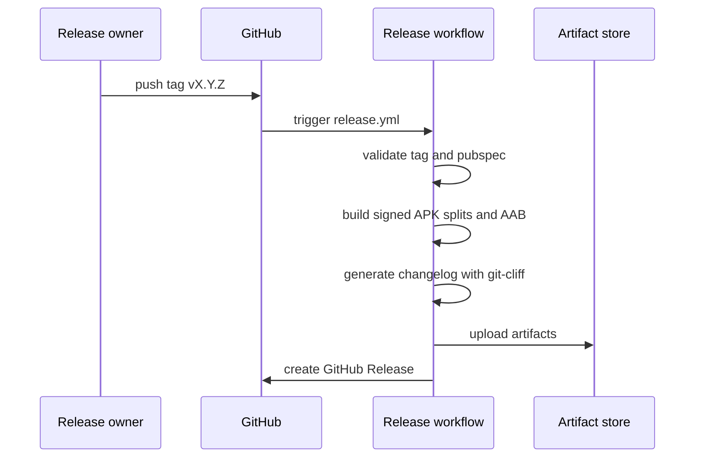

# Release Process

## Release Owner Checklist

- Confirm CI is green on `main`.
- Confirm coverage is at least 70 percent.
- Confirm version in `pubspec.yaml` is correct.
- Confirm GitHub signing secrets exist.
- Confirm no local secrets are staged.
- Confirm beta testers know which build to install.

## Screenshots Placeholder


Replace this with screenshots of GitHub Actions release runs once the repository is public or shared with testers.

## Version Bump

Use semantic versioning for the user-visible version and increment build number for Android:

```yaml
version: 0.1.1+2
```

Commit format:

```bash
git commit -am "chore(release): bump version to 0.1.1"
```

## Tag and Push

```bash
git tag v0.1.1
git push origin main --tags
```

The release workflow validates that `v0.1.1` matches the version prefix `0.1.1` in `pubspec.yaml`.

## GitHub Release Workflow



## Beta Distribution

Phase 0 uses Firebase App Distribution or direct GitHub Release artifact sharing for trusted testers. Google Play Internal Testing is Phase 2.

## Hotfix Flow

```bash
git checkout main
git pull
git checkout -b fix/release-hotfix
# patch and test
git commit -am "fix(release): describe hotfix"
git tag v0.1.2
git push origin main --tags
```

## Manual Validation

After a release artifact is built:

1. Download APK from GitHub Release.
2. Install on physical Android device.
3. Open app and pass splash/login navigation.
4. Create or open a mock project.
5. Exercise editor, subtitle, thumbnail, pricing, and profile screens.
6. Record any blocker in GitHub Issues.
